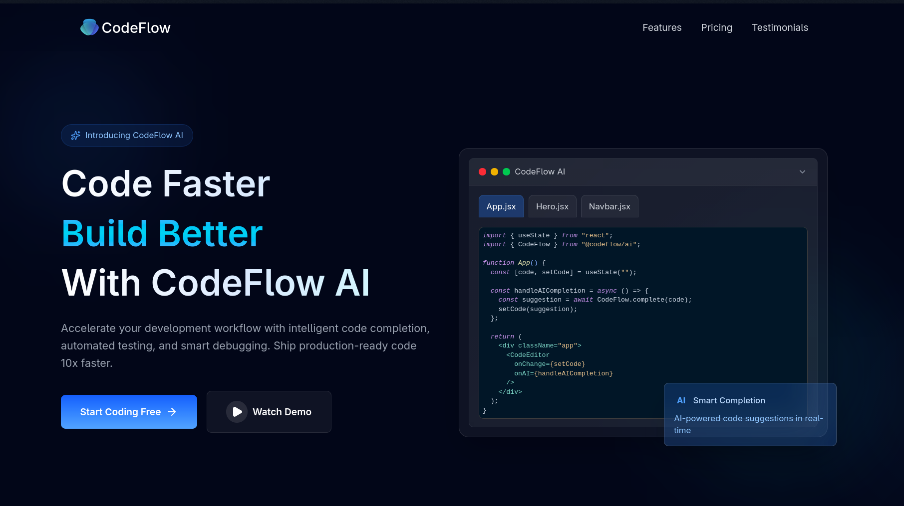
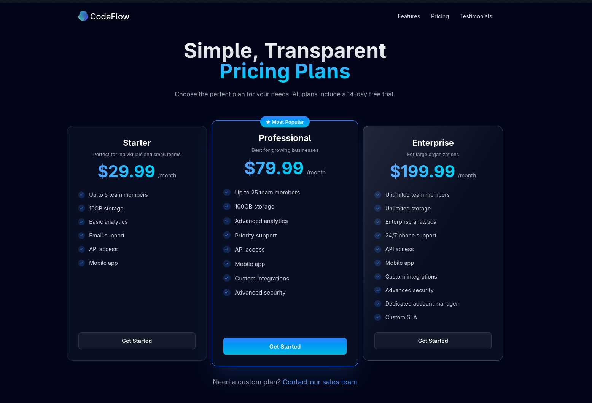
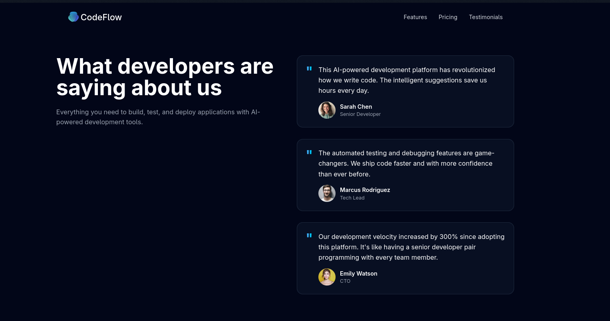
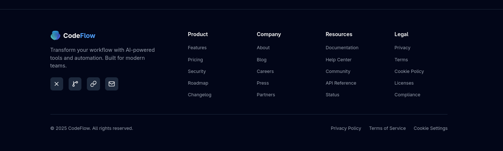

# Modern SaaS Landing Page

A responsive and modern SaaS landing page built with React, Tailwind CSS. Designed with smooth animations, glassmorphism, and a clean UI.

## Preview

### Navbar and Hero Section



---

### Features


---

### Pricing



---

### Testimonials



---

### Footer



## Tech Stack

- React
- Tailwind CSS
- Lucide React

## Features

- Responsive Design
- Modern Glassmorphism UI
- Smooth Animations
- Interactive Pricing Cards
- Customer Testimonials
- Mobile Navigation
- Reusable Components

## Getting Started

```bash
git clone https://github.com/ParveenRawat/ModernLandingPage
cd ModernLandingPage
npm install
npm run dev
```

## Project Structure

```
src/
├── components/
│   ├── Navbar.jsx
│   ├── Hero.jsx
│   ├── Features.jsx
│   ├── Pricing.jsx
│   ├── Testimonials.jsx
│   └── Footer.jsx
├── data/
│   └── examples.js
├── App.jsx
├── index.css
└── main.jsx
```

<!-- ## License -->
<!---->
<!-- MIT -->
